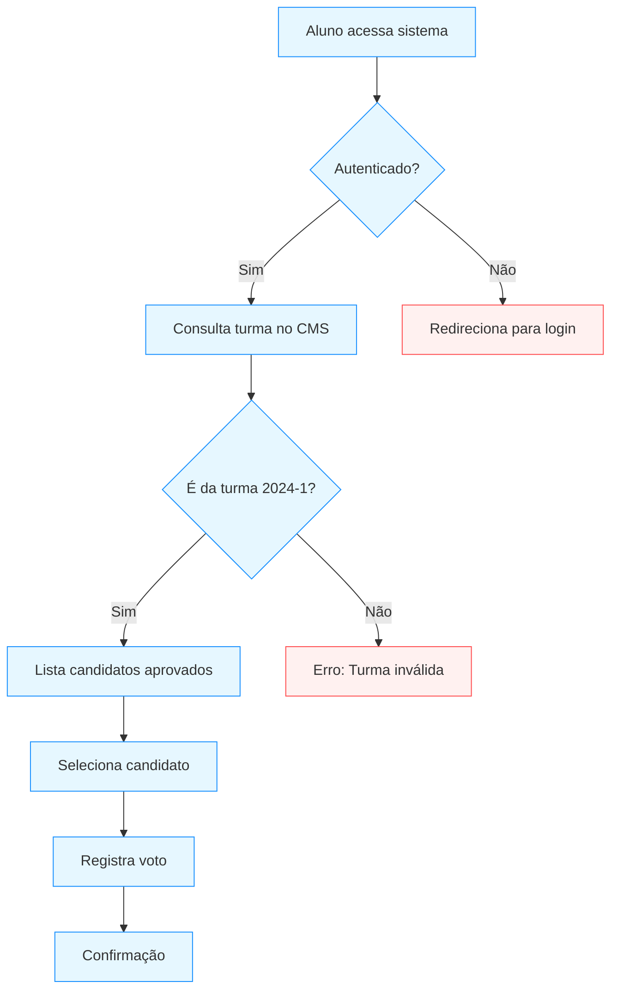
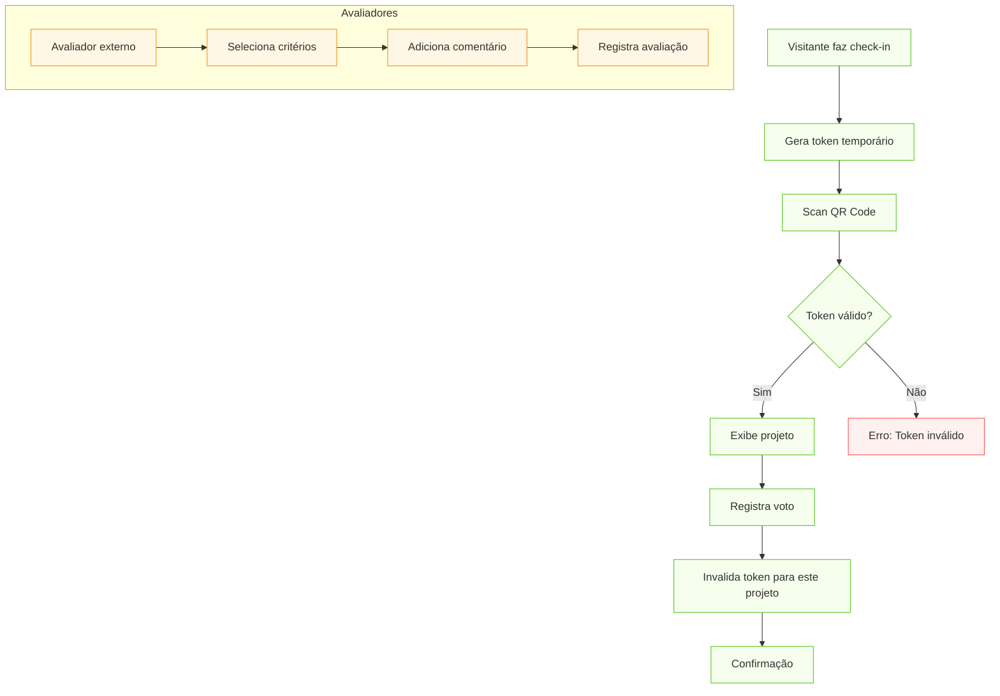
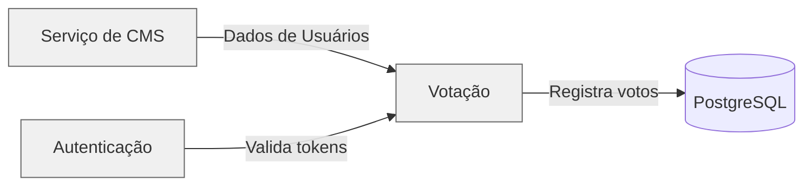

<p align="center">
  <a href="https://fatecregistro.cps.sp.gov.br/" target="blank"></a>
</p>

<p align="center">Laboratório de Práticas é de realização da <a href="https://fatecregistro.cps.sp.gov.br/" target="_blank">Fatec Registro</a> com o objetivo de acrescentar aos alunos um portfólio e, não menos importante, experiência!</p>
<p align="center">
<a href="https://www.instagram.com/fatecregistro/" target="_blank"></a>
</p>

<h1 align="center">Sistema de Votação</h1>

## 📋 Descrição

Sistema seguro para votação de representantes de turma e projetos das feiras FTX/HubTec, integrado com microsserviços de autenticação.

## 👔 Principais tecnologias utilizadas

- [](https://nestjs.com/) (v10)
- [](https://www.prisma.io/) (ORM)
- [](https://www.postgresql.org/) (v15)
- [](https://www.docker.com/) (Conteinerização)

### Pacotes complementares
- [](https://github.com/typestack/class-validator)

## 🔧 Fluxogramas do Sistema

### Votação Interna (Representantes)


### Votação Pública (Feira FTX/HubTec)


## 🔧 Configuração do Projeto

<details>
<summary>🐳 Configuração com Docker</summary>

```bash
# Banco de Dados
docker run --name votacao-db -e POSTGRES_USER=postgres -e POSTGRES_PASSWORD=postgres -e POSTGRES_DB=votacao_db -p 5432:5432 -d postgres

# Aplicação
docker build -t votacao-api .
docker run -p 3000:3000 --link votacao-db votacao-api
```
</details>

<details>
<summary>🔑 Variáveis de Ambiente</summary>

```env
POSTGRES_USER="seu_usuario"
POSTGRES_PASSWORD="sua_senha"
POSTGRES_DB="votacao_db"
DATABASE_URL="sua_url"
PORT=3001
FRONTEND_URL="http://localhost:3000"
```
</details>


## 📌 Integração entre Microsserviços



Principais garantias:
1. Sincronização automática com CMS
2. Validação em tempo real com serviço de autenticação
3. Consistência transacional nos registros

## 🚀 Execução

```bash
# Instalação
npm install

# Iniciar
docker compose up
```

Acesse a documentação em [http://localhost:3001/api](http://localhost:3001/api) para ver os endpoints disponíveis.