<p align="center">
  <a href="https://fatecregistro.cps.sp.gov.br/" target="blank"></a>
</p>

<p align="center">Laboratório de Práticas é de realização da <a href="https://fatecregistro.cps.sp.gov.br/" target="_blank">Fatec Registro</a> com o objetivo de acrescentar aos alunos um portfólio e, não menos importante, experiência!</p>
<p align="center">
<a href="https://www.instagram.com/fatecregistro/" target="_blank"></a>
</p>

<h1 align="center">Sistema de Votação</h1>

## 📋 Descrição

Sistema completo para votação de representantes de turma e projetos das feiras FTX/HubTec, com dois fluxos distintos:

1. **Votação Interna**: Para eleição de representantes de turma (turma 2024-1)
2. **Votação Pública**: Para projetos das feiras FTX e HubTec com validação por token

## 👔 Stack Tecnológica

- [](https://nestjs.com/) v10
- [](https://www.prisma.io/) v6.5
- [](https://www.postgresql.org/) v15

## 🔧 Fluxogramas Principais

### 1. Fluxo de Votação de Representantes

```mermaid
flowchart TD
    A[Aluno acessa tela de votação] --> B[Visualiza lista de candidatos]
    B --> C[Seleciona candidato]
    C --> D[Confirma voto]
    D --> E[Registro no sistema]
    E --> F[Voto confirmado]
    
    classDef fluxo fill:#e6f7ff,stroke:#1890ff;
    class A,B,C,D,E,F fluxo;
```


### 2. Votação na Feira (Projetos FTX/HubTec)

```mermaid
flowchart TD
    A[Visitante faz check-in] --> B[Registra telefone]
    B --> C[Gera token único]
    C --> D[Escaneia QR Code]
    D --> E{Token válido?}
    E -->|Sim| F[Exibe detalhes do projeto]
    E -->|Não| X[Erro: Token inválido]
    F --> G[Permite 1 voto por projeto]
    G --> H[Invalida token para este projeto]
    
    classDef sucesso fill:#f6ffed,stroke:#52c41a;
    classDef erro fill:#fff1f0,stroke:#ff4d4f;
    class A,B,C,D,E,F,G,H sucesso;
    class X erro;
```


## ⚙️ Configuração

```bash
# Banco de Dados
docker run --name votacao-db -e POSTGRES_USER=postgres -e POSTGRES_PASSWORD=postgres -e POSTGRES_DB=votacao_db -p 5432:5432 -d postgres

# Aplicação
npm install
npm run start:dev
```

## 📌 Variáveis de Ambiente
Utilize como base o arquivo de [Exemplo](.env.example)
```env
POSTGRES_USER=
POSTGRES_PASSWORD=
POSTGRES_DB=
DATABASE_URL=
PORT=
```

## 🚀 Execução
```bash
docker-compose up -d
npm run start:dev
```

Acesse: [http://localhost:3001/api](http://localhost:3001/api) para documentação Swagger